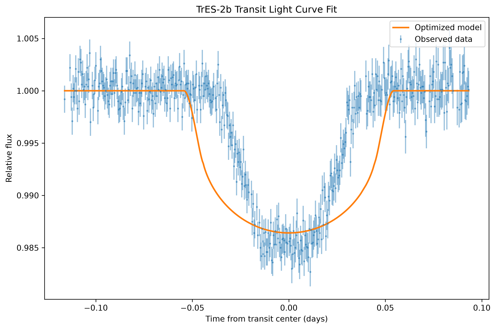
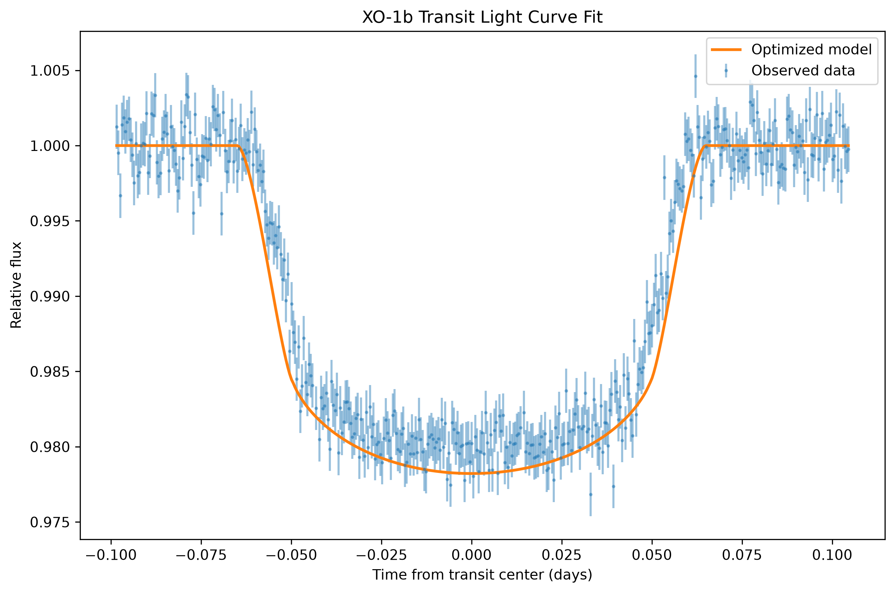

# Transiting Exoplanet Light Curve Analysis

Python-based analysis of observed exoplanet transit light curves for **TrES-2b** and **XO-1b**, using numerical modeling, chi-square optimization, and Markov Chain Monte Carlo (MCMC) sampling to estimate transit parameters and their uncertainties.

## Project Overview

When an exoplanet passes in front of its host star, the observed brightness of the star decreases temporarily. The shape and depth of this transit can be modeled to estimate properties of the planetary system.

This project analyzes observational transit data for two known exoplanets:

- **TrES-2b**
- **XO-1b**

The analysis compares observed relative-flux measurements with theoretical transit light curves based on the Mandel & Agol transit model. Model parameters are optimized using chi-square minimization and further evaluated with MCMC sampling to estimate posterior distributions and parameter uncertainties.

## Tools & Libraries

- Python
- NumPy
- SciPy
- Matplotlib
- SymPy
- emcee
- corner

## Analysis Workflow

### 1. Transit Light Curve Modeling

A transit model based on the Mandel & Agol formulation is used to calculate relative stellar flux as a function of the planet's position during transit.

The model incorporates:

- Planet-to-star radius ratio
- Orbital geometry
- Orbital inclination
- Nonlinear limb-darkening coefficients

A numerically evaluated implementation is used during fitting to allow efficient repeated model calculations.

### 2. Observational Data

Observed transit data for TrES-2b and XO-1b include:

- Time of observation
- Relative stellar flux
- Measurement uncertainty

The observation times are converted to time relative to the center of each transit before fitting.

### 3. Chi-Square Optimization

Model parameters are estimated by minimizing the chi-square statistic between the observed data and theoretical light curve.

The optimization uses SciPy's bounded **L-BFGS-B** algorithm. Physically motivated parameter bounds are applied to prevent invalid model evaluations and constrain the solution to meaningful parameter ranges.

### 4. MCMC Uncertainty Analysis

After obtaining optimized parameters, the `emcee` library is used to perform Markov Chain Monte Carlo sampling.

This provides:

- Posterior parameter distributions
- Parameter uncertainty estimates
- Visualization of parameter correlations
- MCMC trace plots for convergence assessment

Corner plots are used to visualize the resulting posterior distributions.

## Results

### TrES-2b

The optimized transit model reproduces the overall shape and timing of the observed TrES-2b transit.



### XO-1b

The same modeling and fitting process was applied independently to XO-1b.



The analysis demonstrates how numerical optimization and probabilistic sampling can be combined to estimate physical parameters from noisy observational data.

## Repository Structure

```text
transiting-exoplanet-analysis/
│
├── data/
│   ├── tres-2b_transit.txt
│   └── XO-1b_transit.txt
│
├── figures/
│   ├── tres2b_lightcurve_fit.png
│   └── xo1b_lightcurve_fit.png
│
├── transiting_exoplanet_analysis.ipynb
├── requirements.txt
├── .gitignore
└── README.md

```

## Running the Analysis

Clone the repository:

```bash
git clone https://github.com/acdemelfi/transiting-exoplanet-analysis.git
cd transiting-exoplanet-analysis
```

Create a virtual environment:

```bash
python -m venv .venv
```

Activate it on Windows:

```powershell
.\.venv\Scripts\Activate.ps1
```

Install the required packages:

```bash
python -m pip install -r requirements.txt
```

Then open `transiting_exoplanet_analysis.ipynb` in Jupyter Notebook or VS Code with the Jupyter extension.

## Skills Demonstrated

- Scientific data analysis with Python
- Numerical modeling
- Statistical optimization
- Chi-square minimization
- Markov Chain Monte Carlo sampling
- Parameter uncertainty analysis
- Data visualization
- Working with observational datasets
- Reproducible project organization with Git and GitHub

## References

The transit modeling approach is based on methods described in:

- Mandel, K. & Agol, E. (2002), *Analytic Light Curves for Planetary Transit Searches*
- Holman, M. J. et al. (2007), observational transit analysis of TrES-2

## Project Note

This project was originally completed as a university group project. This repository is a portfolio version of work I substantially contributed to, including the Python-based modeling, analysis, and interpretation of the transit data.